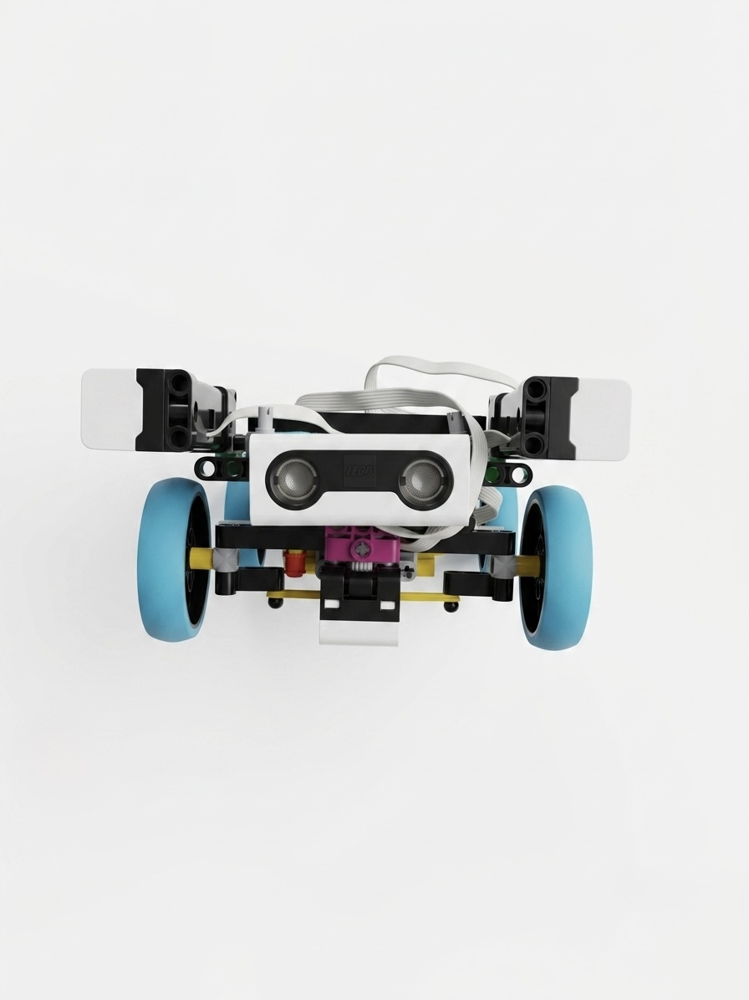

```markdown
</p>

<h1 align="center">Team HypeTech 🇵🇦 — WRO Future Engineers 2026</h1>
<p align="center">
  <i>Panama • WRO Future Engineers Category • Autonomous Robotics • LEGO mBlock Programming</i>
</p>

<p align="center">
  
  
  
</p>

---

## Introduction

We are **HypeTech**, a robotics team from *Colegio San Vicente de Paúl* in Santiago de Veraguas, Panama 🇵🇦.

Our team consists of three students: **Angel Herrera**, **Guillermo Espinosa**, and **Jesus Murillo**. What makes our team unique is that we are not only teammates—we are family. As cousins, we have grown up supporting each other, solving challenges together, and sharing a passion for technology and innovation.

For us, robotics is more than building a machine. It is an opportunity to learn, create, improve, and demonstrate that teamwork and dedication can transform ideas into reality. Every test, every adjustment, and every line of code has helped us grow as future engineers.

Together, we developed **PROJECT H**, an autonomous robot designed to navigate the competition field, complete laps, detect obstacles, and make decisions completely on its own.

---

## Our Robot: **PROJECT H**

<p align="center">
  
</p>

**PROJECT H** is our autonomous self-driving robot created for the WRO Future Engineers challenge.

The robot was designed to complete the competition track independently by detecting walls, identifying turns, avoiding collisions, and counting laps without external assistance.

Its navigation system is based on a custom chassis equipped with proximity sensors, steering mechanisms, and an autonomous control algorithm programmed entirely in **mBlock**.

PROJECT H continuously analyzes its environment and reacts in real time, allowing it to navigate efficiently and complete the challenge with precision and reliability.

---

## Meet Team HypeTech!

<table align="center">
  <tr>
    <td colspan="3" align="center">
      
    </td>
  </tr>
  <tr>
    <td align="center">
      <b>Angel Herrera</b><br>
      Software Developer 💻<br>
      <sub>Develops navigation logic, programming, testing, and problem-solving strategies.</sub>
    </td>
    <td align="center">
      <b>Jesus Murillo</b><br>
      Software Developer 🧠<br>
      <sub>Works on programming optimization, debugging, and engineering solutions.</sub>
    </td>
    <td align="center">
      <b>Guillermo Espinosa</b><br>
      Mechanical Builder ⚙️<br>
      <sub>Designs, assembles, and improves the robot's structure and hardware.</sub>
    </td>
  </tr>
</table>

---

## Repository Content

This repository documents the complete development process of PROJECT H.

| Folder | Description |
|----------|-------------|
| [`models/`](./models) | Contains 3D models and design files used in the robot's development. |
| [`schemes/`](./schemes) | Includes wiring diagrams and component connection layouts. |
| [`src/`](./src) | Contains the complete mBlock programming files used by PROJECT H. |
| [`t-photos/`](./t-photos) | Team photographs and official documentation images. |
| [`v-photos/`](./v-photos) | Robot photographs from multiple perspectives. |
| [`video/`](./video) | Videos demonstrating the robot's performance during testing and competition runs. |

---

## Engineering Materials

Below is a summary of the main components used in PROJECT H.

- LEGO Robotics Controller Hub
- 1 Large Motor for propulsion
- 1 Steering Motor for directional control
- 3 Proximity Sensors
- Rechargeable Battery System
- Custom Chassis Structure
- LEGO mBlock Programming Environment

---

## Building Instructions

### Robot Structure

PROJECT H was designed and assembled entirely by our team. The chassis combines stability, maneuverability, and efficient sensor placement to maximize navigation performance.

### Operating Diagram

The [`schemes/`](./schemes) folder contains diagrams showing the robot's electrical connections, sensor locations, and hardware configuration.

### Programming Code

The [`src/`](./src) folder contains all programming files developed using mBlock. These programs control movement, navigation, obstacle detection, steering, and lap counting.

> All software development, testing, assembly, and integration were completed by Team HypeTech.

> **PROJECT H is constantly evolving.**
> Through continuous testing and improvement, both hardware and software may be updated throughout the season.

---

## PROJECT H Mobility System

### Key Functional Behaviors

#### 1. Autonomous Forward Movement

- The robot uses a large motor to move forward.
- The proximity sensors continuously monitor the environment.
- The system maintains smooth and stable movement during operation.

#### 2. Wall Detection

- Three proximity sensors constantly measure the distance between the robot and surrounding walls.
- These readings help the robot understand its position on the track.

#### 3. Turning Logic

- When a sensor detects the absence of a wall where one is expected, PROJECT H recognizes a corner.
- The steering motor executes the corresponding turn.
- After completing the maneuver, the robot returns to its normal navigation path.

#### 4. Obstacle Avoidance

- The proximity sensors identify nearby objects and track boundaries.
- The robot reacts automatically to avoid collisions while maintaining course progression.

#### 5. Lap Completion and Stop Behavior

- PROJECT H tracks its progress by counting turns throughout the course.
- Once the robot completes twelve registered turns, it understands that the challenge is complete.
- The motors stop and the robot remains safely in its final position.

---

### Why These Components?

| Component | Purpose & Reason |
|------------|-----------------|
| **Large Motor** | Provides reliable forward movement and propulsion. |
| **Steering Motor** | Controls directional changes and corner navigation. |
| **Proximity Sensors (x3)** | Detect walls, obstacles, and navigation references. |
| **Controller Hub** | Processes sensor data and executes programmed logic. |
| **Battery System** | Supplies power to all electronic components. |
| **Custom Chassis** | Provides structural stability and optimal component placement. |

---

## Navigation Strategy

The navigation system developed for PROJECT H allows the robot to operate completely autonomously throughout the competition.

Using mBlock programming and real-time sensor readings, the robot continuously evaluates its environment and makes decisions based on predefined engineering logic.

---

### Open Round Strategy

In the Open Round, PROJECT H focuses on consistency, precision, and stability.

1. **Initialization**
   - All sensors and motors are activated.
   - Navigation variables are reset.

2. **Lap Execution**
   - The robot follows the walls of the track.
   - Sensor readings guide movement and turning decisions.
   - The system tracks completed turns throughout the course.

3. **Completion**
   - After completing the required route, the robot automatically stops.
   - All motors return to a safe resting position.

---

### Obstacle Round Strategy

During obstacle-based challenges, PROJECT H combines wall tracking and obstacle detection to navigate safely.

1. **Continuous Scanning**
   - The three proximity sensors constantly monitor the surroundings.

2. **Decision Making**
   - The robot analyzes sensor data using programmed logic blocks.
   - Decisions are made autonomously without remote control.

3. **Obstacle Detection**
   - If an obstacle or unexpected object is detected, the robot adjusts its movement accordingly.

4. **Corner Recognition**
   - When a wall is no longer detected, the robot recognizes an upcoming turn.
   - The steering motor performs the required maneuver.

5. **Challenge Completion**
   - After detecting twelve completed turns, the robot stops automatically.

> PROJECT H operates fully autonomously using engineering logic, sensor feedback, and programmed decision-making.

---

## More Than a Robot

PROJECT H is much more than motors, sensors, and programming blocks.

It represents teamwork, family, perseverance, and countless hours of dedication.

As cousins and teammates, we have learned that great engineering is built through collaboration, trust, creativity, and continuous improvement.

Every challenge we overcome makes us stronger—not only as competitors, but as future engineers.

**Welcome to Team HypeTech.**
```
