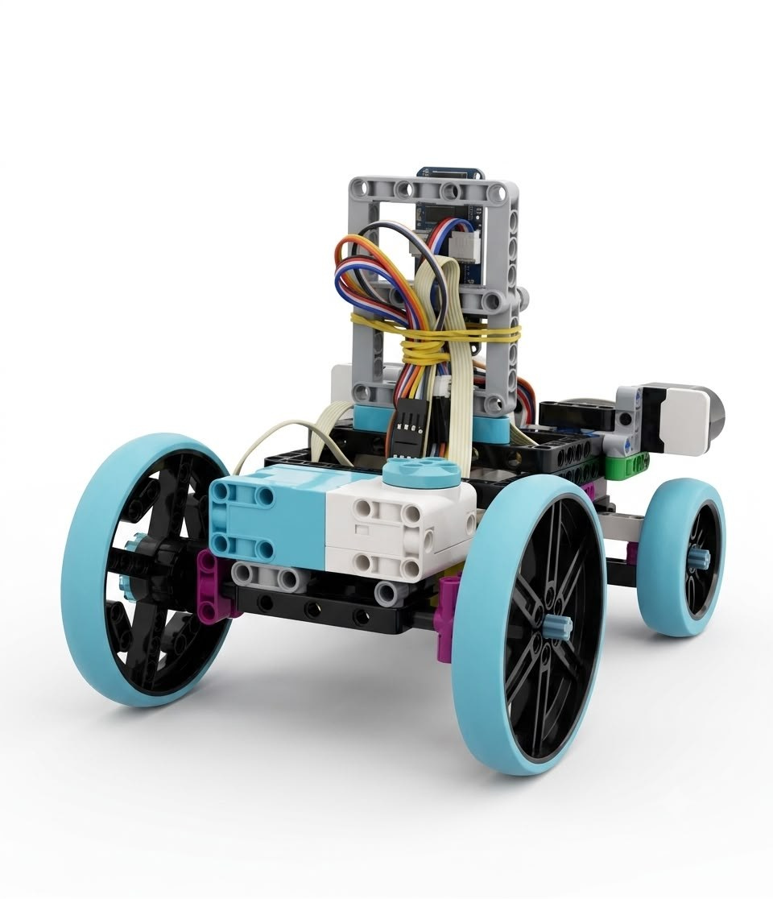
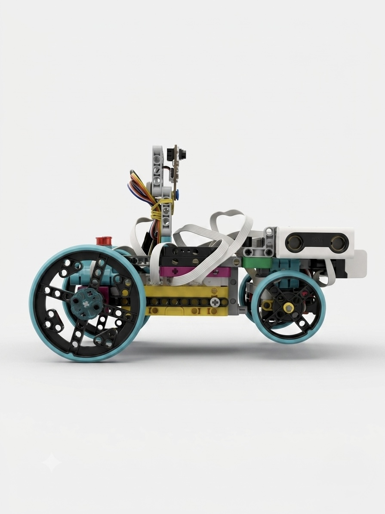
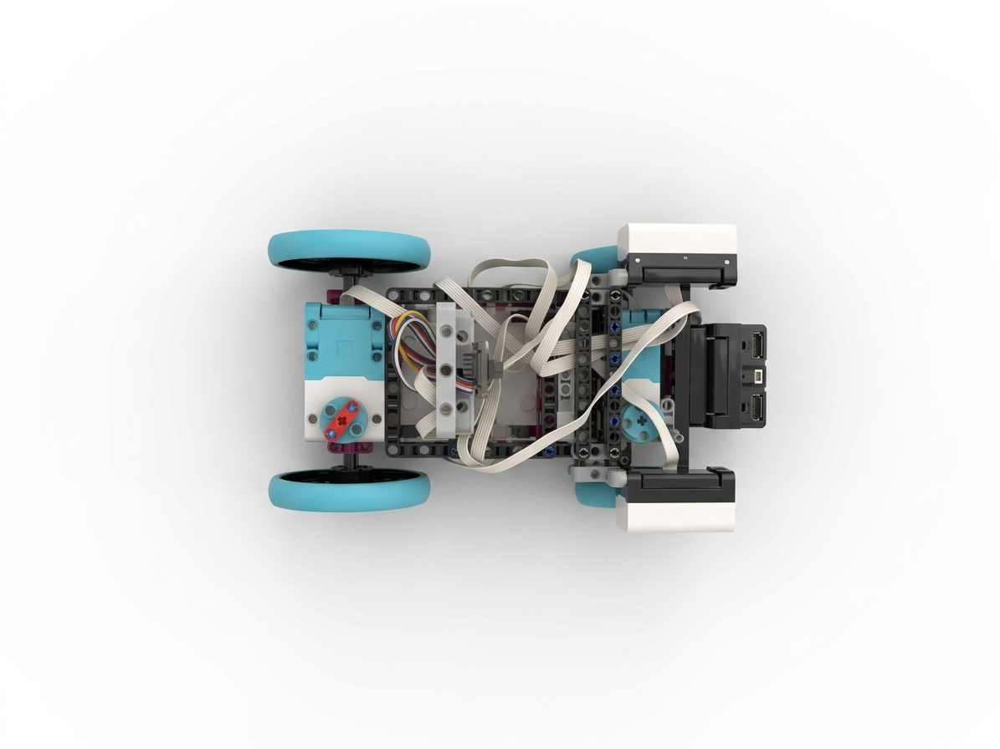
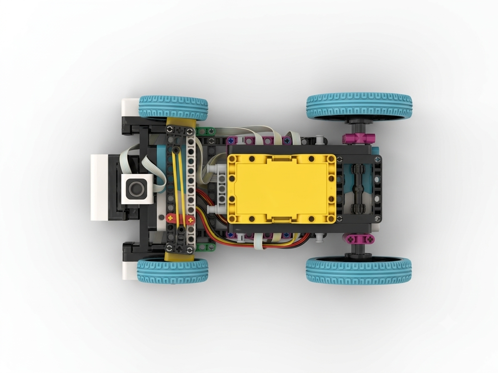
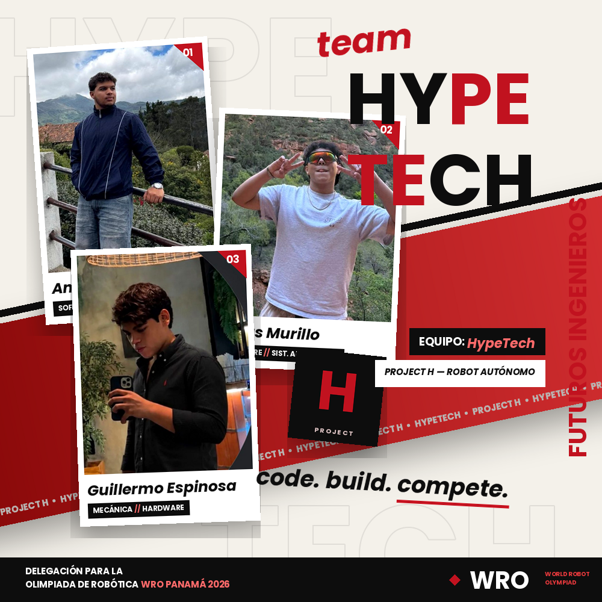

# 🚀 Team HypeTech 🇵🇦

### *WRO Future Engineers 2026*

📍 **Santiago de Veraguas, Panama**
🏫 **Colegio San Vicente de Paúl**
🤖 **Future Engineers Category**

---

# 🌟 Introduction

Welcome to **Team HypeTech**, a passionate robotics team proudly representing **Colegio San Vicente de Paúl** in Santiago de Veraguas, Panama.

Our team consists of **Angel Herrera**, **Guillermo Espinosa**, and **Jesus Murillo**. More than teammates, we are family. As cousins, we have spent years sharing challenges, ideas, successes, and failures. This unique bond has allowed us to develop strong communication, trust, and teamwork—qualities that become invaluable when facing engineering challenges under pressure.

For us, robotics is far more than a competition.

It is an opportunity to learn, innovate, solve real-world problems, and demonstrate how dedication, creativity, and perseverance can transform ideas into reality.

Every piece of our robot tells a story of countless hours spent designing, testing, troubleshooting, rebuilding, and improving. Through this journey, we continue developing the mindset of future engineers while strengthening the values that define us as a team.

> **Our mission is simple: learn continuously, improve relentlessly, and always give our very best.**

---

# 🤖 Our Robot — PROJECT H

**PROJECT H** is our autonomous robot developed specifically for the **WRO Future Engineers Challenge**.

Designed to operate completely independently, PROJECT H can:

✅ Navigate the competition field autonomously
✅ Follow walls with precision
✅ Detect and avoid obstacles
✅ Execute accurate turns
✅ Complete multiple laps without external control

Built on a custom-designed chassis and powered by a LEGO-based robotics platform, PROJECT H is programmed entirely in **mBlock** and driven by a navigation system created and optimized by our team.

Using multiple proximity sensors, steering mechanisms, and a custom decision-making algorithm, the robot continuously analyzes its environment and reacts in real time to changing conditions.

What truly makes PROJECT H special is not only its hardware and software, but the teamwork, determination, and engineering mindset behind every component.

---

# 📸 Vehicle Photos — PROJECT H

The robot's structure balances a compact footprint with easy access to its internal components, allowing quick adjustments and repairs between competition rounds. Every component — from the drivetrain to the sensor layout — was chosen and positioned with one goal in mind: completing every challenge of the competition with **speed, precision, and reliability**.

Below you can see PROJECT H from every angle.

## 🔍 Full View — All Angles

| Front | Back |
|:---:|:---:|
|  |  |

| Left Side | Right Side |
|:---:|:---:|
|  |  |

| Top | Bottom |
|:---:|:---:|
|  |  |

## 📷 What Each View Shows

- **Front:** The front **proximity sensor** mounted at the nose of the robot for wall and obstacle detection, flanked by the front bumper panels. The steering assembly sits directly behind it.
- **Back:** The rear of the chassis, where the **drive motor and transmission** deliver power to the rear wheels, along with the elevated mast that houses part of the robot's electronics and cable routing.
- **Left / Right sides:** The full profile of the chassis — larger drive wheels at the rear, smaller steering wheels at the front, and the sensor mast raised above the body for a clear view of the track. The cable routing along the frame keeps every connection secure during runs.
- **Top:** The overall component distribution seen from above — the frame layout, cable management, and the rear hub ports, all organized for accessibility and balanced weight.
- **Bottom:** The underside of the chassis, showing the **robotics hub** seated at the core of the structure, the steering linkage at the front, and the rear axle transmission — a low center of gravity built for stability at competition speeds.

  <i>Every angle of PROJECT H reflects a design decision — nothing is where it is by accident.</i> ⚙️

---

# 👨‍💻 Meet Team HypeTech

## 💻 Angel Herrera

### Role in the team
Responsible for the robot's programming architecture. Angel works extensively on **sensor integration, navigation logic, and performance optimization**, as well as troubleshooting during testing sessions.

### 🏆 Achievements & Robotics Background
- 🇵🇦 **National Qualifier – WRO Panamá** — Earned classification to the national stage of the World Robot Olympiad, competing among the country's top teams.
- 🤖 **Multi-category Competitor** — Has competed in different robotics modalities at the national level, building versatile experience across challenges and rulesets.

### 💡 Motivation and Focus
If the robot works on the first try, something is wrong. Debug, retry, repeat — that's where the fun is.

---

## 🧠 Jesus Murillo

### Role in the team
Responsible for the robot's **autonomous decision-making system**. Jesus contributes to software development, debugging, and optimization, using systematic testing and analytical thinking to transform concepts into reliable engineering solutions.

### 🏆 Achievements & Robotics Background
- 🇵🇦 **National Qualifier – WRO Panamá** — Earned classification to the national stage of the World Robot Olympiad, competing among the country's top teams.
- 🤖 **Multi-category Competitor** — Has competed in different robotics modalities at the national level, adapting strategies to every type of challenge.

### 💡 Motivation and Focus
Think twice, code once. Every problem has a logical solution — you just have to find it before the round timer does.

---

## ⚙️ Guillermo Espinosa

### Role in the team
Responsible for the robot's **mechanical design and construction**. Guillermo leads the assembly, refinement, and optimization of PROJECT H's structure, ensuring every component operates efficiently and reliably.

### 🏆 Achievements & Robotics Background
- 🇵🇦 **National Qualifier – WRO Panamá** — Earned classification to the national stage of the World Robot Olympiad, competing among the country's top teams.
- 🤖 **Multi-category Competitor** — Has competed in different robotics modalities at the national level, designing and building robots for a variety of challenges.

### 💡 Motivation and Focus
Build it strong, build it smart, build it again if you have to. A great robot starts with hands that never stop improving it.

---

  

  <b>HypeTech</b> — code. build. compete. 🤖

---

# 🛠️ Engineering Materials

PROJECT H was developed using a modular robotics platform and the following components:

- LEGO Robotics Controller Hub
- 1 Large Motor for propulsion
- 1 Steering Motor for directional control
- 3 Proximity Sensors
- Rechargeable Battery System
- Custom Chassis Structure
- LEGO mBlock Programming Environment

---

# 🧭 Navigation Strategy

PROJECT H operates through a fully autonomous, rule-based navigation system programmed in **mBlock**.

The robot constantly monitors its surroundings and makes real-time decisions based on data collected from its sensors.

---

## 📡 Wall Detection

Three proximity sensors continuously measure distances to nearby surfaces.

These measurements allow PROJECT H to:

- Detect walls
- Maintain optimal positioning
- Determine upcoming turns
- Stay aligned throughout the course

---

## ↩️ Turning Logic

When the robot detects the absence of a wall where one is expected, it identifies a corner and initiates a turning sequence.

The steering system then activates, allowing PROJECT H to perform precise turns and continue following the track.

---

## 🧠 Decision-Making System

PROJECT H does not rely on remote control or artificial intelligence.

Instead, it uses a carefully designed set of programmed conditions and logical rules that enable it to:

- Analyze sensor data
- Make consistent decisions
- Adapt to changing conditions
- Operate independently during competition

---

## 🚧 Obstacle Avoidance

The robot uses its three proximity sensors to identify obstacles and track boundaries.

This enables PROJECT H to:

- Avoid collisions
- Maintain smooth navigation
- Preserve stability during operation

---

## 🔄 Lap Counting

PROJECT H tracks its progress by monitoring completed turns throughout the course.

After successfully registering twelve turns, the robot recognizes that the challenge has been completed and automatically stops.

---

# 🏁 Open Round Strategy

During the Open Round, PROJECT H focuses on:

- Stability
- Precision
- Consistent movement

The robot follows track boundaries, executes accurate turns, and completes three laps while maintaining reliable orientation and controlled speed.

---

# 🎯 Challenge Round Strategy

In obstacle-based rounds, PROJECT H combines wall tracking and obstacle detection to navigate safely and efficiently.

Its sensors continuously monitor the environment, allowing the robot to react dynamically while remaining focused on completing the course with maximum accuracy and consistency.

---

# ❤️ More Than a Robot

PROJECT H represents much more than motors, sensors, and lines of code.

It represents:

🤝 Teamwork
👨‍👩‍👦 Family
💪 Perseverance
🚀 Innovation
🎯 Determination

As cousins, friends, and teammates, we have learned that great engineering is built not only through technology, but also through trust, communication, collaboration, and resilience.

Every challenge has strengthened us.

Every failure has taught us.

Every improvement has brought us one step closer to becoming the engineers we aspire to be.

---

# 🌎 Welcome to Team HypeTech

> **"Engineering is not about building robots. It's about building solutions, overcoming challenges, and never stopping the pursuit of improvement."**

Thank you for visiting our project and joining us on our journey through robotics, innovation, and engineering excellence.

### 🚀 Team HypeTech — WRO Future Engineers 2026 🇵🇦
