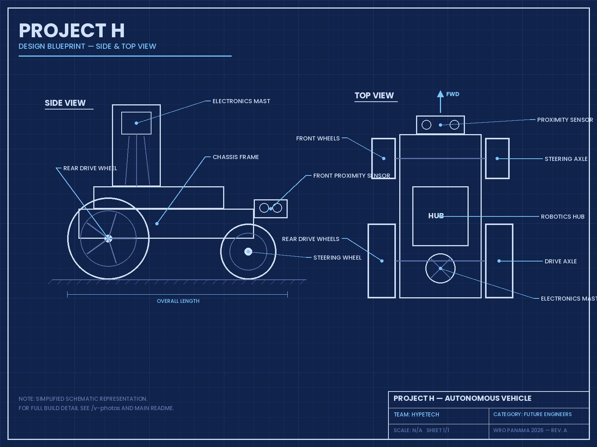
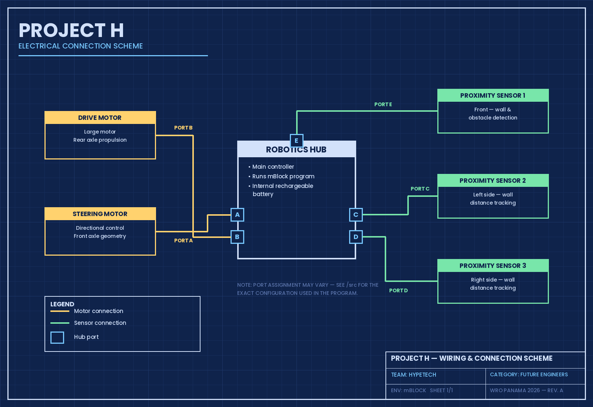

# 🧱 3D Models — PROJECT H

This folder contains the design documentation and 3D model resources of **PROJECT H**, the autonomous vehicle built by Team HypeTech for the WRO Future Engineers challenge.

## About the Design

PROJECT H was designed and built physically first, following an iterative prototyping process: build → test → analyze → rebuild. Every structural decision — wheel size, sensor placement, steering geometry, weight distribution — was validated directly on the competition track.

The robot is built on a modular LEGO-based platform, which allows us to:

- **Iterate quickly** — components can be repositioned and tested in minutes
- **Repair on the spot** — damaged parts are swapped without redesigning the structure
- **Keep the design documented** — every element corresponds to a standard, identifiable part

## Design Blueprint

A simplified technical schematic of PROJECT H, showing the side and top views with the main components labeled:

  

The blueprint highlights the core layout decisions of the vehicle: the front proximity sensor at the nose, the steering axle with smaller front wheels, the robotics hub seated at the center of the chassis for a low center of gravity, the rear drive axle with larger wheels, and the elevated electronics mast at the rear.

## Digital Model

> 🚧 **Work in progress:** We are currently rebuilding PROJECT H digitally in [BrickLink Studio](https://www.bricklink.com/v3/studio/download.page) to provide the complete `.io` model file, photorealistic renders, and step-by-step building instructions. This section will be updated soon.

The complete digital model of PROJECT H is available in this folder:

| File | Description |
|---|---|
| `project-h.io` | Full 3D model — BrickLink Studio format |
| `project-h-instructions.pdf` | Step-by-step building instructions |
| `render-front.png` / `render-side.png` | Photorealistic renders of the model |

To open the `.io` file, download [BrickLink Studio](https://www.bricklink.com/v3/studio/download.page) (free, available for Windows and Mac).
-->

## Reference Photos

While the digital model is in progress, the complete physical build can be seen from all six angles in the [`v-photos`](../v-photos) folder, and the design rationale is explained in the main [README](../README.md).

# ⚡ Schemes — PROJECT H

This folder contains the electrical and mechanical schematics of **PROJECT H**.

## Electrical Connection Scheme

The diagram below shows how every electromechanical component of the robot connects to the central robotics hub:

  

## Component Overview

| Component | Connection | Function |
|---|---|---|
| **Drive Motor** (Large) | Port B | Propulsion — powers the rear axle |
| **Steering Motor** | Port A | Directional control — turns the front wheels |
| **Proximity Sensor 1** | Port E | Front — wall and obstacle detection |
| **Proximity Sensor 2** | Port C | Left side — wall distance tracking |
| **Proximity Sensor 3** | Port D | Right side — wall distance tracking |
| **Battery** | Internal | Rechargeable system integrated in the hub |

> ⚠️ Port assignment shown here is representative — see the program in [`/src`](../src) for the exact configuration used in competition.

## How the Layout Supports Our Strategy

- The **front sensor** gives the robot early warning of walls and obstacles ahead, driving the turning logic.
- The **two side sensors** allow continuous wall-following: the robot compares left and right distances to stay centered and detect missing walls (corners).
- Separating **propulsion** (rear) from **steering** (front) gives PROJECT H car-like kinematics — a requirement of the Future Engineers category — and smoother, more predictable turns than differential steering.
